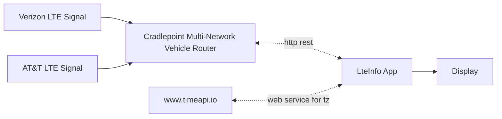

# cradleptinfoinfo - Display Cradlepoint data acquired from http queries to screen

This program (named) was developed for the [IEEE MOVE project](https://move.ieee.org).

The program acquires data from [Cradlepoint modems like the R1900](https://cradlepoint.com/product/endpoints/r1900-series/) using http and 
displays it to the screen.

Colorization of 4G LTE parameters is from the article 
[Mobile Signal Strength Recommendations][1]

[1]: https://wiki.teltonika-networks.com/view/Mobile_Signal_Strength_Recommendations

