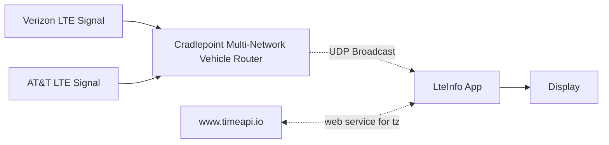

# cradleptinfoinfo - Display Cradlepoint data acquired from UDP broadcasts to screen

This program (named) was developed for the [IEEE MOVE project](https://move.ieee.org).

The program receives UDP broadcast packets from [Cradlepoint MG90](https://www.sierrawireless.com/products-and-solutions/routers-gateways/mg90/) and 
displays them to the screen.

Colorization of 4G LTE parameters is from the article 
[Mobile Signal Strength Recommendations][1]

[1]: https://wiki.teltonika-networks.com/view/Mobile_Signal_Strength_Recommendations

